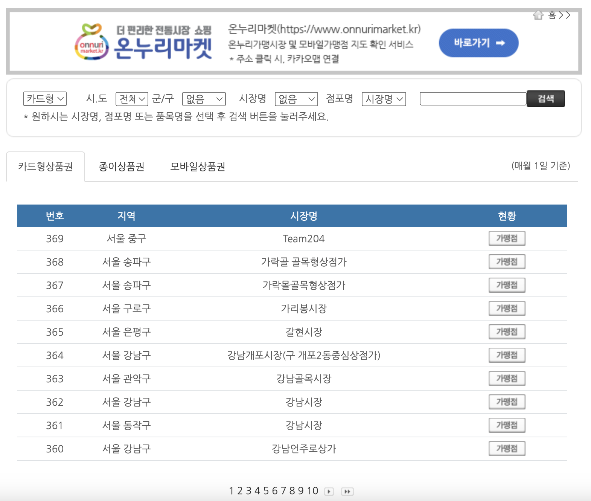
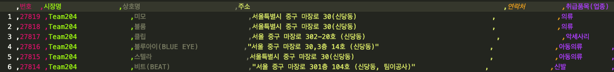

# 소상공인 프로젝트 : 온누리 상품권 가맹점 찾기

## 문제 : 온누리 상품권 가맹점을 찾기 너무 어려움

온누리 상품권 공식 페이지에서는 간단한 검색 기능을 제공하고 있습니다. 그러나 사용자 입장에서 이 정보들이 지도로 표현되면 어떨까? **그렇다면 더 많은 소상공인에게 이득이 돌아가지 않을까?** 라는 질문으로 시작했습니다.

## 문제해결 1 : 가맹점 정보 가져오기
가맹점 정보를 제공하는 API는 존재하지 않았습니다. 따라서 해당 웹사이트로 부터 데이터를 가져오는 작업이 필요했습니다. 웹스크래핑 또는 웹 크로울링은 다소 논쟁이 많은 기술이기는 합니다. 현재 제가 찾은 기사를 기준으로 사용자에게 모두 공개되어 있는 자료를 스크래핑해서 쓰는 경우 불법이 아닌것으로 알고 있습니다. 또한 해당 프로젝트는 상업용 보다는 개인 토이 프로젝트입니다. **만약의 문제를 대비해 방법은 공개하지만 데이터는 따로 올리지 않도록 하겠습니다.**

첫번째 단계는 endpoint를 찾는 방법입니다. `F12`를 눌러 endpoint를 찾은 후 `Selenium`을 이용해 데이터를 취득했습니다. 해당 [코드](./01_traditional_market_to_pkl.py)에 포함되어 있습니다.

## 문제해결 2 : 통계청 SGIS를 이용해 GeoCoding 실행하기
최초에 데이터를 가져오면 아래와 같이 주소는 있지만 좌표가 없습니다. 주소로 부터 좌표를 얻는 방법을 GeoCoding이라고 합니다. 네이버, 카카오 등에서 GeoCoding을 제공해주지만, 시행착오를 겪으며 코딩을 할 때 토큰차감이 많을 것을 예상해 무료인 [SGIS](https://sgis.kostat.go.kr/developer/html/main.html)의 API를 사용했습니다. 

해당 코드를 구현한 내용은 [아래코드](./02_read_pkl_and_save_data.py)에서 찾아볼 수 있습니다. 데이터 양이 꽤나 방대하기 때문이 100개씩 끊어서 요청을 보냈습니다. 인증키를 발급받아 `.env`파일에 넣은 후 코드를 실행해야 작동합니다.