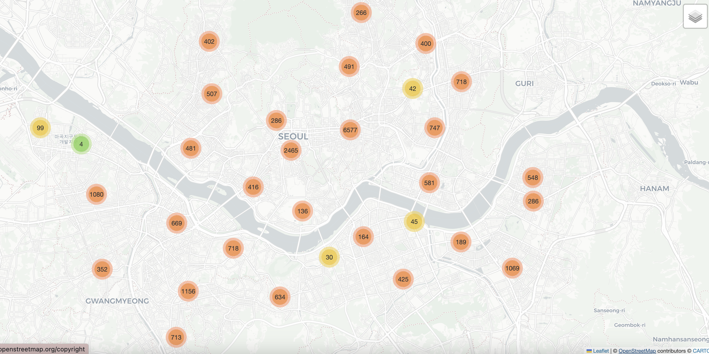
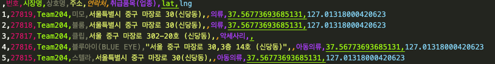
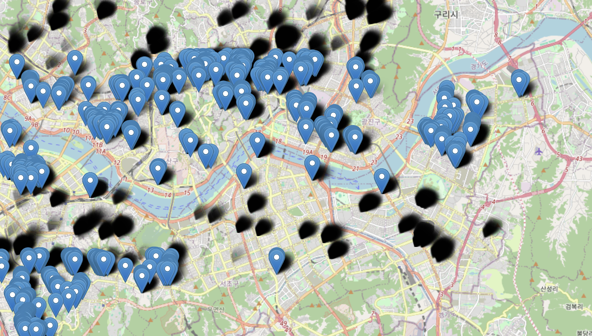
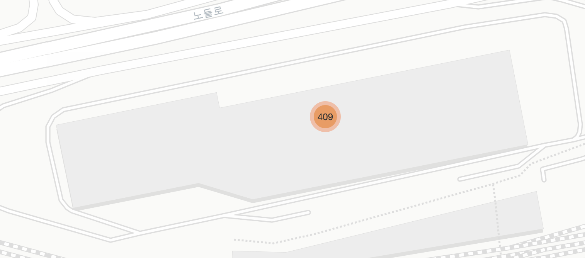
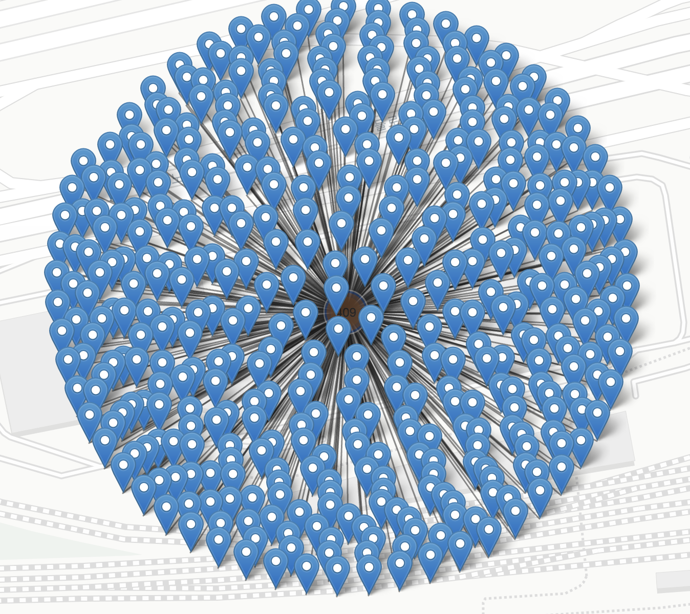

# 소상공인 프로젝트 : 온누리 상품권 가맹점 찾기

아이디어는 아주 작은 곳에서부터 시작했습니다. **나는 온누리 상품권을 쓰고 싶은데 도대체 가맹점은 어디에 있지?** 이런 작은 물음에서 부터 본 프로젝트를 시작하게 되었습니다. 저는 개인적으로 재밌었고, 아직 수정해야할 기능도 꽤나 있지만 그래도 일단 올려봅니다.

## 문제 : 온누리 상품권 가맹점을 찾기 너무 어려움

온누리 상품권 공식 페이지에서는 간단한 검색 기능을 제공하고 있습니다. 그러나 사용자 입장에서 이 정보들이 지도로 표현되면 어떨까? **그렇다면 더 많은 소상공인에게 이득이 돌아가지 않을까?** 라는 질문으로 시작했습니다.

## 문제해결 1 : 가맹점 정보 가져오기
가맹점 정보를 제공하는 API는 존재하지 않았습니다. 따라서 해당 웹사이트로 부터 데이터를 가져오는 작업이 필요했습니다. 웹스크래핑 또는 웹 크로울링은 다소 논쟁이 많은 기술이기는 합니다. 현재 제가 찾은 기사를 기준으로 사용자에게 모두 공개되어 있는 자료를 스크래핑해서 쓰는 경우 불법이 아닌것으로 알고 있습니다. 또한 해당 프로젝트는 상업용 보다는 개인 토이 프로젝트입니다. **만약의 문제를 대비해 방법은 공개하지만 데이터는 따로 올리지 않도록 하겠습니다.**

첫번째 단계는 endpoint를 찾는 방법입니다. `F12`를 눌러 endpoint를 찾은 후 `Selenium`을 이용해 데이터를 취득했습니다. 해당 [코드](./01_traditional_market_to_pkl.py)에 포함되어 있습니다.

## 문제해결 2 : 통계청 SGIS를 이용해 GeoCoding 실행하기
최초에 데이터를 가져오면 아래와 같이 주소는 있지만 좌표가 없습니다. 주소로 부터 좌표를 얻는 방법을 GeoCoding이라고 합니다. 네이버, 카카오 등에서 GeoCoding을 제공해주지만, 시행착오를 겪으며 코딩을 할 때 토큰차감이 많을 것을 예상해 무료인 [SGIS](https://sgis.kostat.go.kr/developer/html/main.html)의 API를 사용했습니다. 

해당 코드를 구현한 내용은 [아래코드](./02_read_pkl_and_save_data.py)에서 찾아볼 수 있습니다. 데이터 양이 꽤나 방대하기 때문이 100개씩 끊어서 요청을 보냈습니다. 인증키를 발급받아 `.env`파일에 넣은 후 코드를 실행해야 작동합니다.

해당 내용을 구현한 후 데이터는 다음과 같이 변하는 것을 볼 수 있습니다. lat,lng가 추가되었습니다.

## 문제해결 3 : 지도에 띄우기
위 과정을 거치면 약 2만 5천개의 PoI(Point of Intest)가 생성됩니다. 최초아이디어는 모두다 한번에 때려넣는 것 이었습니다. 그러나 계획은 맞기 전까지 유효합니다.

데이터를 모두 넣는 경우 위 그림처럼 랜더링이 거의 불가능 합니다. 다행히도 `leaflet.js`를 이용하는 `folium`에서는 클러스터링 기능을 지원합니다. 해당 기능을 사용했을때 결과가 어떨지 궁금했습니다. 결과적으로 2만5천개의 데이터를 다루는데 전혀 지장이 없었습니다. 다만 zoom level이 깊어졌을때도 원하는 정보를 보기 어렵다는 단점도 있었습니다. 무슨 말인지는 [최종지도](./market_clustered.html)를 통해 확인하실 수 있습니다.

해결 3번의 [코드](./03_add_props_to_blank_data.ipynb)를 확인해보세요

## 한계
위에서 언급한 몇몇 점들이 한계라 할 수 잇습니다. 이는 다시 이프로젝트에서 추가로 진행해야하는 Todo-list가 됩니다.

 -  **아직 미흡한 UX** : 하나의 마커를 보기까지 줌을 끝까지 당겨야합니다.빠르게 훑어가면서 보고싶은 유저에겐 단점입니다.
 - **카테고리별 구분 어려움** : 기존 상업용 지도에 익숙한 우리에게 승에 차지 않습니다. 이런 기능을 넣을 필요가 있습니다.
 - **Base map** : 뒤에 까는 지도가 상당히 중요합니다. 대부분의 사람들은 Naver, Kakao, 국토지리정보원, OSM, Google 등을 사용합니다. 그러나 내가 원하는 정보를 명확히 전달하기 위해선 본인만의 Map Tile을 가져야 합니다.
 - **GeoCoding** : SGIS의 Geocoding은 한계가 있습니다. 노량진 시장과 같이 모든 시설이 모인 곳에서 모든 점이 한곳에 모여있습니다. 이는 어느정도 구분해서 보여주는 네이버 지도와 차이점입니다. 해당 내용을 수정할 필요가 있습니다.

### todo
- [ ] 카테고리별 켜고 끄기 
- [ ] 카테고리별 색상 차이
- [ ] 맵타일(다른 프로젝트를 통해)